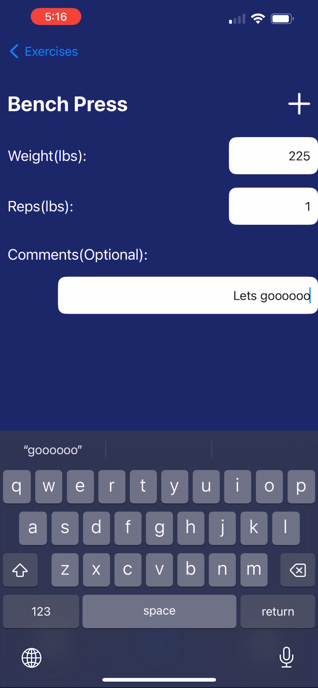
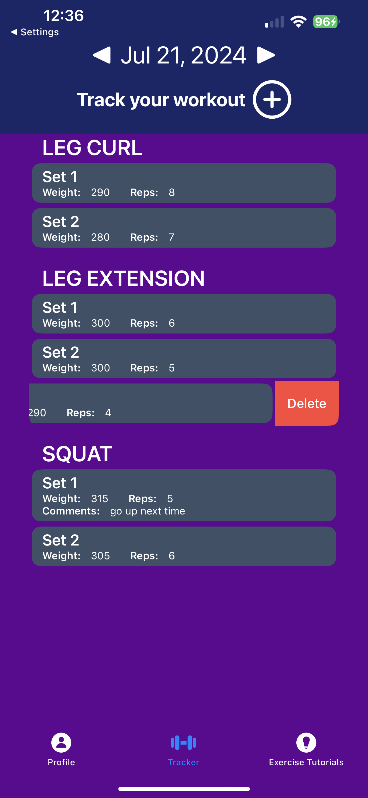
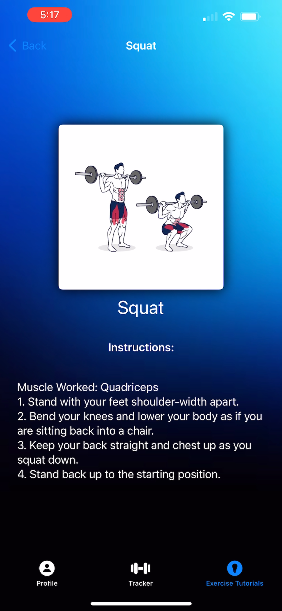
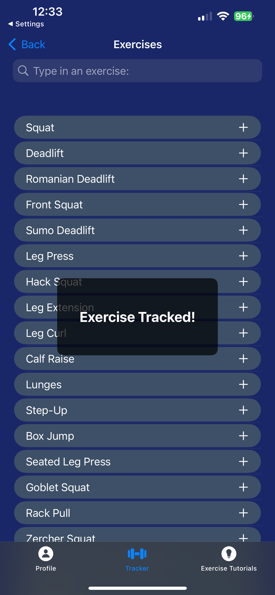
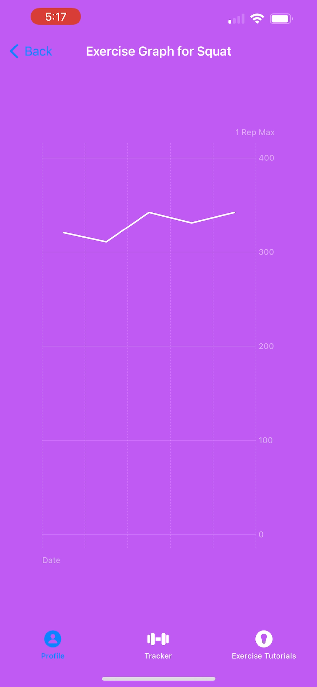

<div align="center">
	<h1>Zenith Workout App</h1>

[](https://opensource.org/licenses/MIT)
</div>


### Welcome to Zenith! This iOS application is designed to help users track their fitness goals and maintain a healthy lifestyle and will be constantly updated with new features. Currently, the supported functionalities are listed below but more functionalities such as social features will be added in the future.

## Functionality
1. **User Authentication:** Zenith allows users to create accounts and log in securely using Firebase Authentication. This ensures that each user's workout data remains private and accessible only to them.

2. **Workout Tracking:** Users can track their workouts with ease using Firebase Firestore. The app allows users to log their workouts, including details like exercise, number of reps, number of sets and any comments. Data is stored securely in Firebase, providing seamless synchronization across devices.

3. **Exercise Library:** Zenith offers a comprehensive library of exercises within the app. Users can explore different workouts and learn new exercises to incorporate into their routines. 

4. **Progress Tracking:** Users can monitor their progress over time within the app. Visual representations of progress are displayed with graphs.

5. **Realtime Data:** With the use of the HealthKit API, users are able to see the amount of calories burned and steps taken at any point throughout the day.

## Sample Images of the Functionalities
<p align="center">
  
  
  
  
  
  
</p>


## Installation and Running
1. Clone this repository to your local machine.
```bash
git clone https://github.com/LucasHJin/Zenith-App
```
2. Set up Firebase project and configure Firebase Authentication and Firestore Database.
3. Update Firebase configuration in the Swift code of the app.
4. Install any necessary dependencies via Swift Package Manager.
5. Build and run the app on a simulator or physical iOS device.

## Known Bugs
- Currently, only **light mode** is supported and attempts to use dark mode may result in unforseen visual irritations

## Contact Information
In case of any errors or bugs, please contact:
- **kblazer20@gmail.com**